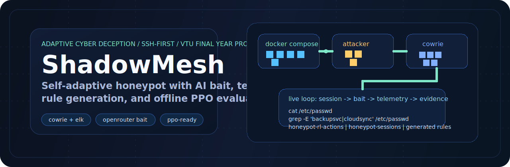
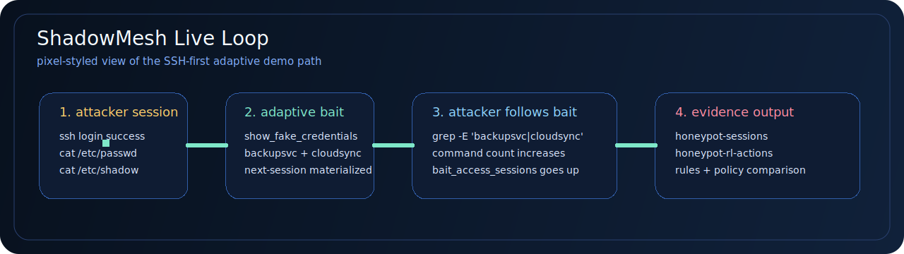

<p align="center">
  
</p>

<p align="center">
  
  
  
  
</p>

<p align="center">
  
  
  
  
</p>

# ShadowMesh

## Self-Adaptive Honeypot for Intelligent Cyber Deception

ShadowMesh is a final-year cybersecurity engineering project focused on building a **self-adaptive honeypot framework** that is harder to fingerprint, more useful for attacker observation, and better aligned with modern threat-intelligence workflows than a static decoy.

The project combines three major ideas into a single system:

- **Adaptive deception:** an RL-driven control layer is designed to react to attacker behaviour in real time.
- **Generative bait content:** AI-generated filesystem artifacts make the honeypot look more realistic and less repetitive across sessions.
- **Telemetry-driven defense output:** captured attacker activity is intended to be transformed into practical detection artifacts such as Snort and YARA rules.

This repository currently contains the working foundation of that system: a containerized Cowrie-based honeypot environment, a logging and session-normalization pipeline, an attacker simulator, and the first integration of the generative bait layer.

## At A Glance

| What makes it stand out | What is already working |
|---|---|
| Adaptive bait that changes attacker-visible artifacts instead of serving one static decoy forever | SSH-first Cowrie stack with Docker, Elasticsearch, Kibana, attacker simulation, and adaptive bait visibility on `/etc/passwd` and `/etc/shadow` |
| AI-generated deception content using OpenRouter | Repeatable baseline vs adaptive evidence collection with packaged reviewer summaries |
| Research-facing pipeline with PPO, policy comparison, and generated detection artifacts | Offline PPO smoke training, PPO inference, rule generation, and evidence packaging |

## Live Loop Preview

<p align="center">
  
</p>

This is the current repo story in one line: **attacker lands in Cowrie -> adaptive bait gets materialized -> attacker follows the bait -> telemetry, rules, and evidence are generated from the same session flow.**

---

## Problem Statement

Traditional honeypots are useful for basic observation, but they often suffer from the same weakness: they are static. Once an experienced attacker recognizes the environment as fake, the session ends quickly and the intelligence value drops sharply.

ShadowMesh is being built to address that gap by making the environment:

- more believable through realistic bait placement and content generation
- more measurable through centralized telemetry and session summaries
- more adaptive through AI-assisted environment changes
- more actionable through downstream rule-generation and structured attack intelligence

---

## Current Project Status

ShadowMesh is under active development. At the time of writing, the repository includes:

- a **Dockerized SSH honeypot stack** built around Cowrie
- a **log forwarding pipeline** that normalizes Cowrie events into Elasticsearch
- a **session aggregation layer** for attacker behaviour analysis
- a **multi-profile attacker simulator** for generating repeatable training and testing activity
- an **OpenRouter-backed generative layer** that creates realistic bait artifacts for the honeypot filesystem
- a **rule-generation module** that derives first-pass Snort and YARA artifacts from session summaries
- an **RL contract scaffold** that defines the observation space, action space, and action logging interface
- a **live adaptive bridge** that can log baseline actions and materialize selected bait files into Cowrie for deterministic next-session adaptation

Planned next milestones include:

- stronger **baseline vs adaptive evaluation** with larger replay datasets
- broader **offline PPO evaluation** before live policy replacement
- broader **web/deception surface expansion**

---

## Architecture Overview

```text
                          ┌─────────────────────────────┐
                          │        Honeypot Network     │
                          │         172.18.0.0/24       │
                          │                             │
  ┌───────────┐  SSH/HTTP │  ┌──────────┐               │
  │ Attacker  │──────────►│  │  Cowrie  │               │
  │ Container │           │  │ (Fake SSH)│              │
  └───────────┘           │  └────┬─────┘               │
                          │       │ raw events          │
                          │       ▼                     │
                          │  ┌──────────────┐           │
                          │  │ Log Forwarder│           │
                          │  │ + Aggregator │           │
                          │  └──────┬───────┘           │
                          │         │                   │
                          │         ▼                   │
                          │  ┌──────────────┐           │
                          │  │ Elasticsearch│           │
                          │  │   + Kibana   │           │
                          │  └──────┬───────┘           │
                          │         │                   │
                          │   ┌─────┼───────────┐       │
                          │   ▼     ▼           ▼       │
                          │ Attacker RL Agent   Rule    │
                          │ Insights (planned)  Gen     │
                          │                   (planned) │
                          │         ▲                   │
                          │         │                   │
                          │  ┌──────┴──────┐            │
                          │  │ Generative  │            │
                          │  │ Bait Layer  │            │
                          │  │ (OpenRouter)│            │
                          │  └─────────────┘            │
                          └─────────────────────────────┘
```

---

## Implemented Components

| Layer | Technology | Purpose |
|---|---|---|
| Honeypot | [Cowrie](https://github.com/cowrie/cowrie) | SSH honeypot used to capture attacker interaction |
| Infrastructure | Docker Compose | Reproducible local deployment and service orchestration |
| Log Pipeline | Python + Elasticsearch | Normalizes raw Cowrie logs into queryable documents |
| Visualization | Kibana | Session and attack telemetry inspection |
| Attacker Simulation | Paramiko + python-nmap | Generates repeatable attacker sessions with multiple profiles |
| Generative Layer | LiteLLM + OpenRouter API | Produces realistic bait files for deception and anti-fingerprinting |
| Rule Generation | Python + Elasticsearch | Converts session summaries into Snort and YARA artifacts |
| Agent Scaffold | Gymnasium + NumPy | Defines the RL observation/action contract and logs agent decisions |
| Adaptive Bridge | Agent runner + executor | Applies selected actions back into Cowrie during live sessions |

---

## Repository Structure

```text
shadowmesh/
├── infra/              Docker Compose, Cowrie configuration, service wiring
├── logging/            Log forwarder and session aggregation logic
├── agent/              RL agent workspace (planned / in progress)
├── attacker/           Automated attacker simulation and wordlists
├── generative/         AI bait-file generation and cached artifacts
├── rules/              Rule-generation workspace and output directory
├── docs/               Contribution guide and project documentation
├── data_contracts.md   Inter-module integration contract
├── pyproject.toml      Shared Python configuration
└── README.md
```

---

## Quick Start

### 1. Clone the repository

```bash
git clone https://github.com/Raheedpasha10/shadowmesh.git
cd shadowmesh
```

### 2. Configure environment variables

```bash
cp .env.example .env
# Fill in OPENROUTER_API_KEY and any model overrides you want to use
```

### 2.1 Python runtime note for RL work

The general project supports Python 3.10+, but the current PPO toolchain is
validated on **Python 3.11**. If you are running the RL scripts locally, use
the Python 3.11 environment so `torch` and `stable-baselines3` resolve cleanly.

Example:

```bash
.venv311/bin/python -m agent.train --help
```

### 3. Start the core stack

```bash
cd infra
docker compose up -d
```

This starts:

- Cowrie on port `2222`
- Elasticsearch on port `9200`
- Kibana on port `5601`
- the Python log forwarder

### 4. Verify services

```bash
docker compose ps
curl http://localhost:9200/_cluster/health
```

### 5. Open Kibana

Visit [http://localhost:5601](http://localhost:5601).

### 6. Run an attacker simulation

```bash
# Single opportunist session
docker compose --profile attack run --rm attacker python simulate.py --profile opportunist --sessions 1

# Multiple mixed sessions
docker compose --profile attack run --rm attacker python simulate.py --sessions 3

# Continuous simulation loop
docker compose --profile attack run --rm attacker python simulate.py --loop
```

---

## Attacker Profiles

The attacker simulator currently supports three behavioural profiles for generating more diverse honeypot interactions.

| Profile | Style | Behaviour |
|---|---|---|
| `scriptkiddie` | Fast and noisy | Heavy brute force, shallow enumeration |
| `opportunist` | Moderate | Common credential attempts and standard recon |
| `targeted` | Slow and deliberate | More realistic post-login exploration and deeper enumeration |

---

## Generative Bait Layer

The current AI layer uses OpenRouter through LiteLLM to generate realistic deception artifacts such as:

- `/etc/passwd`
- `/etc/shadow`
- `/root/.bash_history`
- `/var/www/html/config.php`
- `/opt/novapay/.env`
- `/root/.ssh/id_rsa`

These files are intended to make the environment look more natural to an attacker and reduce obvious honeypot fingerprinting patterns.

Important current reality:

- the generator can build a wider bait corpus than the live demo currently proves
- the most reliable adaptive demo path right now is on attacker-visible Cowrie files such as `/etc/passwd` and `/etc/shadow`
- some other generated artifacts are already useful as decoy content, but are not yet part of the strongest measurable live adaptation path

---

## Rule Generation

The current rule-generation layer reads `honeypot-sessions` documents from Elasticsearch and produces:

- a Snort `.rules` file with attacker-IP and command-pattern detections
- a YARA `.yar` file summarizing the session's most important commands
- an Elasticsearch record in `honeypot-generated-rules`

Example usage:

```bash
# Generate rules for the latest session
python3 rules/generator.py

# Generate rules for a specific session without indexing the output
python3 rules/generator.py --session-id <session_id> --dry-run

# Include still-active sessions if you are debugging the live loop
python3 rules/generator.py --include-active --limit 3 --dry-run
```

Generated rule artifacts are written to `rules/output/YYYY-MM-DD/` and kept out of Git.

---

## Agent Scaffold

The `agent/` directory now contains the contract-aligned groundwork for the adaptive layer:

- `contracts.py` defines the exact state vector and discrete action map from `data_contracts.md`
- `runtime.py` provides an Elasticsearch-backed action logger for `honeypot-rl-actions`
- `environment.py` exposes a lightweight Gymnasium environment stub for replaying session summaries
- `runner.py` emits deterministic baseline actions from live `honeypot-sessions`
- `executor.py` materializes the first supported adaptive actions back into Cowrie
- `export_sessions.py`, `train.py`, and `evaluate.py` support replay export, offline PPO runs, and final comparison work
- `collect_evidence.py` packages paired baseline/adaptive exports and a saved evaluation report for reviewer-ready evidence
- `compare_policies.py` compares deterministic and PPO policies on the same replay dataset
- `package_evidence.py` turns one evidence folder into a reviewer-friendly summary report

This is intentionally a scaffold, not a trained PPO agent yet. It gives the team a stable integration surface before model training starts.

The offline PPO smoke path is now validated:

- replay dataset loads correctly
- `check_env` passes during training
- a smoke PPO model can be saved under `agent/models/`
- saved PPO models can be used with `agent.infer`

### Adaptive Loop

The current live loop is deliberately small and SSH-first:

1. Cowrie events are normalized into Elasticsearch.
2. `honeypot-sessions` is updated while the session is still active and again when it closes.
3. `agent-runner` applies a baseline policy such as `show_fake_credentials_after_successful_session`.
4. The resulting action is logged into `honeypot-rl-actions`.
5. `action-executor` materializes the corresponding bait files into Cowrie's honeyfs.
6. The next attacker session can discover those adaptive files in a deterministic way.

This gives the project a real adaptive control path before PPO training is introduced, while staying honest about the current Cowrie integration limits.

### Evidence And Evaluation

The repo now supports a simple baseline-vs-adaptive evaluation flow:

- export closed sessions from Elasticsearch into replay datasets
- compare those datasets with `python -m agent.evaluate`
- save reviewer-friendly evidence tables for the report and viva

Example:

```bash
python -m agent.evaluate \
  --baseline scratch/session_replays/baseline_sessions.json \
  --adaptive scratch/session_replays/adaptive_sessions.json \
  --format markdown \
  --output scratch/evidence/latest_evaluation.md
```

---

## Data Contract

All inter-component communication is governed by [data_contracts.md](data_contracts.md). This file defines:

- Elasticsearch index names
- expected document schemas
- RL state and action formats
- generative layer manifest structure
- rule-generation output format
- Docker network and environment-variable standards

If you are changing integration behaviour, read that file first.

---

## Development Standards

See [docs/CONTRIBUTING.md](docs/CONTRIBUTING.md) for:

- commit conventions
- Python style rules
- Docker standards
- team ownership boundaries
- definition of done

For the current dataset, PPO, and demo workflow, see
[docs/EVIDENCE_WORKFLOW.md](docs/EVIDENCE_WORKFLOW.md).

---

## Team

| Member | Role |
|---|---|
| Raheed Pasha | Attacker simulation, generative layer, evaluation |
| Pranathi C | AI/ML lead, RL environment, adaptive decision layer |
| Saarthak Singh | Infrastructure, Cowrie, container orchestration |
| Parthiv Banik | Logging, data pipeline, Elasticsearch/Kibana |

**Institution:** AMC Engineering College, Bengaluru  
**Department:** Computer Science and Engineering  
**Academic Year:** 2026-27

---

## Research Direction

This project is influenced by prior work in adaptive honeypots, deception systems, and reinforcement learning for cyber defense. The current implementation is intended as an engineering prototype and research platform for evaluating whether adaptive and generative deception can improve attacker engagement and intelligence collection.

Key references:

1. Păuna, A., & Bica, I. (2014). *RASSH - Reinforced Adaptive SSH Honeypot*. 2014 10th International Conference on Communications (COMM).
2. Ahmed, R., et al. (2025). *SPADE: Enhancing Adaptive Cyber Deception Strategies with Generative AI and Structured Prompt Engineering*.
3. Schulman, J., et al. (2017). *Proximal Policy Optimization Algorithms*.

---

## License

This project is licensed under the MIT License.
